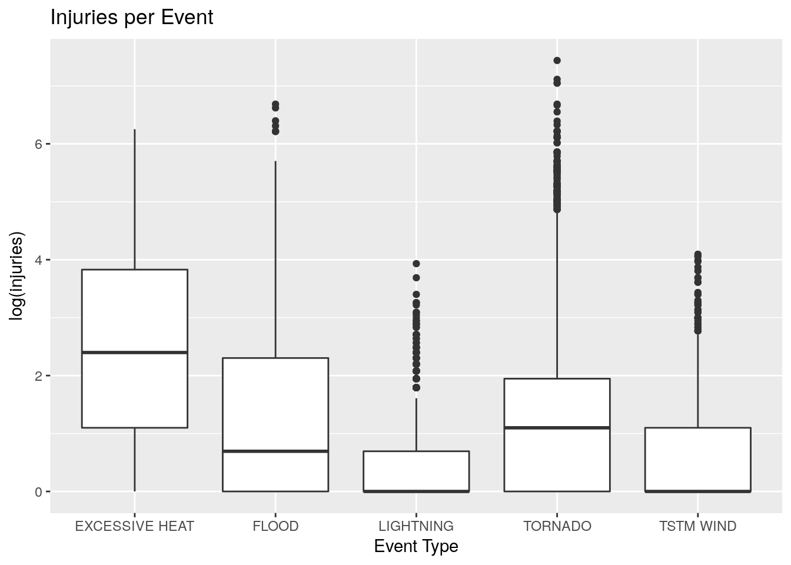
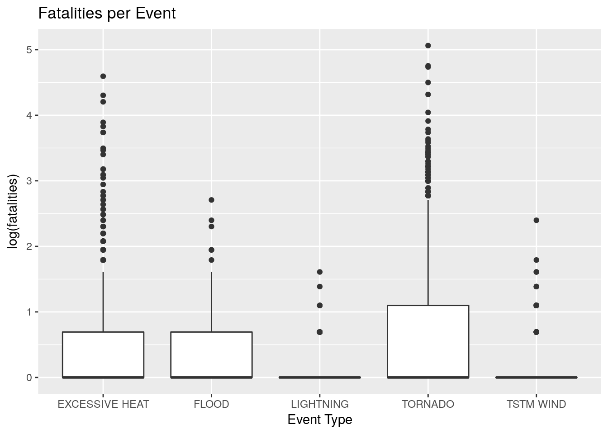
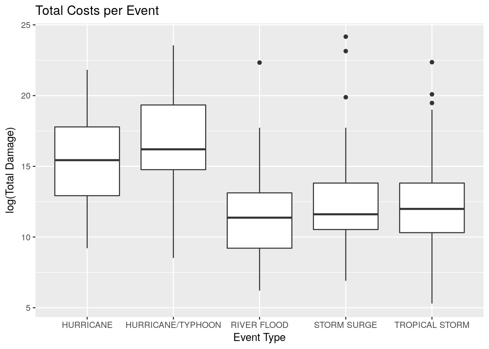

# Storm Effects on Health


## Synopsis

Our goal is to answer the following two questions:

1. Across the United States, which types of events (as indicated in the EVTYPE variable) are most harmful with respect to population health?

2. Across the United States, which types of events have the greatest economic consequences?


## Data processing


We start by downloading the data set and reading it into R.  This first bit of code is set to eval=FALSE.  If you do need to download the file, run this code in R before reading in the table.


```r
download.file("https://d396qusza40orc.cloudfront.net/repdata%2Fdata%2FStormData.csv.bz2", "NOAAstorm.bz2")
```

Now that the data is saved in NOAAstorm.bz2, we can read it and start our analysis.


```r
storm <- read.csv(bzfile("NOAAstorm.bz2"))
```

This data was downloaded on July 31, 2017.  The two packages that are required for this are dplyr and ggplot2.  Let's load those now.


```r
library(dplyr)
library(ggplot2)
```

For our first question, we will focus on both the injury and death columns.  And for the second question, we will look at the property damage column and property damage exponent.  All of this will be grouped by the event type so all analysis will be run on the following slimmed down table.


```r
storm <- storm %>% select(EVTYPE, FATALITIES, INJURIES, PROPDMG, PROPDMGEXP) %>%
        group_by(EVTYPE)
```

The last little bit of clean up is to take care of that PROPDMGEXP.  According to the documentation, this should be of a value K, M, or B to indicate, thousands, millions, or billions.  However, there are some other values here too:


```r
unique(storm$PROPDMGEXP)
```

```
##  [1] K M   B m + 0 5 6 ? 4 2 3 h 7 H - 1 8
## Levels:  - ? + 0 1 2 3 4 5 6 7 8 B h H K m M
```

One can take educated guesses that the numeric values like "7" correspond with multiplying the damage cost by 10^7.  Also, we could assume H and h correspod with hundreds, m with millions
The good news is that there are 902297 observations in our data and these other values make up a very small proportion of our data:


```r
err <- sum(!(storm$PROPDMGEXP %in% c("", "K", "M", "B")))
err
```

```
## [1] 328
```

```r
pcterr <- err/nrow(storm) *100
pcterr
```

```
## [1] 0.03635167
```

Since we'll be adding up all these damages to determine the most expensive, the billions entry will overwhelm anything with a millions entry (or smaller).  Thus if we remove the 0.0363517 percent that don't correspond with the detailed values, it's not going to change the final cost values, especially if we only have three digits of accuracy.

So in the following chunk, we'll create a new function that takes in the property damage value and the "exponent" and outputs an actual cost value.  Then we'll apply it to our storm data set to creat a new column that contains these values.


```r
cost <- function(x){
        if(x[2] == "B"){as.numeric(x[1])*10^9}
        else if(x[2] == "M"){as.numeric(x[1])*10^6}
        else if(x[2] == "K"){as.numeric(x[1])*10^3}
        else if(x[2] == ""){as.numeric(x[1])}
        else{NA}
}

tc <- apply(storm[,4:5],1,cost)
storm <- cbind(storm, totaldmg = tc)
```

## Results

### Question One

#### Numerics

Let's recall our first question before digging into the data.

1. Across the United States, which types of events (as indicated in the EVTYPE variable) are most harmful with respect to population health?

The first thing we can do is calculate which event caused the most combined injuries fatalities and injuries.


In particular, we'll find the five most dangerous event types in terms of total deaths and injuries then look at the boxplots for each.  In the following output, I'm including the top 20 most dangeros event types so we can see a lot more data.  But we'll focus on the top five shortly after.


```r
cas <- storm %>% summarize(injured = sum(INJURIES), dead = sum(FATALITIES))
casfive <- cas %>% mutate(total = injured + dead) %>%
        arrange(desc(total))
worstfive <- casfive[1:5,1]
casfive[1:20,]
```

```
## # A tibble: 20 x 4
##                EVTYPE injured  dead total
##                <fctr>   <dbl> <dbl> <dbl>
##  1            TORNADO   91346  5633 96979
##  2     EXCESSIVE HEAT    6525  1903  8428
##  3          TSTM WIND    6957   504  7461
##  4              FLOOD    6789   470  7259
##  5          LIGHTNING    5230   816  6046
##  6               HEAT    2100   937  3037
##  7        FLASH FLOOD    1777   978  2755
##  8          ICE STORM    1975    89  2064
##  9  THUNDERSTORM WIND    1488   133  1621
## 10       WINTER STORM    1321   206  1527
## 11          HIGH WIND    1137   248  1385
## 12               HAIL    1361    15  1376
## 13  HURRICANE/TYPHOON    1275    64  1339
## 14         HEAVY SNOW    1021   127  1148
## 15           WILDFIRE     911    75   986
## 16 THUNDERSTORM WINDS     908    64   972
## 17           BLIZZARD     805   101   906
## 18                FOG     734    62   796
## 19        RIP CURRENT     232   368   600
## 20   WILD/FOREST FIRE     545    12   557
```

NOTES: 

* We see tornados at the top of the list as expected.  
* We seem to have some *very* similar event types in the list: 
     * EXCESSIVE HEAT and HEAT
     * TSTM WINDS, THUNDERSTORM WIND, and THUNDERSTORM WINDS
     * FLOOD and FLASH FLOOD  

I decided to keep these event types separate.  There's a lot of cleaning up that one could do with the event types to get a better estimate of the total fatalities and injuries for each event.  We'll leave that for another time.

#### Plots

Now let's go back to our original slimmed down table, "storm", filter the data set so just these top five are considered and look at some plots.  First we'll create a boxplot for each event type where each data point is the total injuries from one occurrence of said event. Then we'll do the same with fatalities.

NOTES:

* I applied a log transform (extremely right skewed) so we'll receive a warning telling us how many entries have zero injuries or deaths.
* I didn't use log(injuries + 1) or log(fatalaties + 1)
 because over 75% of the data is zero entries for each event type.
 

```r
storminjfat <- storm %>% filter(as.character(EVTYPE) %in% as.character(worstfive$EVTYPE))
ggplot(storminjfat, aes(EVTYPE, log(INJURIES))) + 
        geom_boxplot() + 
        xlab("Event Type") + 
        ylab("log(injuries)") +
        ggtitle("Injuries per Event")
```

```
## Warning: Removed 309845 rows containing non-finite values (stat_boxplot).
```

<!-- -->

Now we'll do the same with fatalities.


```r
ggplot(storminjfat, aes(EVTYPE, log(FATALITIES))) + 
        geom_boxplot() + 
        xlab("Event Type") + 
        ylab("log(fatalities)")+
        ggtitle("Fatalities per Event")
```

```
## Warning: Removed 319707 rows containing non-finite values (stat_boxplot).
```

<!-- -->


### Question Two

#### Numerics

Now we move onto our second question:

2. Across the United States, which types of events have the greatest economic consequences?

Just like in question 1, we'll start by looking at a table of the most costly events.  Then we'll focus on the top five and look at their box plots.


```r
cost <- storm %>% 
        summarize(cost_billions = signif(sum(totaldmg)/10^9,3)) %>% 
        arrange(desc(cost_billions))
costlyfive <- cost[1:5,1]
cost[1:20,]
```

```
## # A tibble: 20 x 2
##                        EVTYPE cost_billions
##                        <fctr>         <dbl>
##  1          HURRICANE/TYPHOON        69.300
##  2                STORM SURGE        43.300
##  3                  HURRICANE        11.900
##  4             TROPICAL STORM         7.700
##  5                RIVER FLOOD         5.120
##  6                   WILDFIRE         4.770
##  7           STORM SURGE/TIDE         4.640
##  8           WILD/FOREST FIRE         3.000
##  9  HEAVY RAIN/SEVERE WEATHER         2.500
## 10 TORNADOES, TSTM WIND, HAIL         1.600
## 11        SEVERE THUNDERSTORM         1.210
## 12                    DROUGHT         1.050
## 13                 HEAVY RAIN         0.694
## 14                   BLIZZARD         0.659
## 15                 WILD FIRES         0.624
## 16                    TYPHOON         0.600
## 17                  LANDSLIDE         0.325
## 18          FLASH FLOOD/FLOOD         0.272
## 19             HURRICANE ERIN         0.258
## 20                  HAILSTORM         0.241
```


Just like in our analysis of question one, we see a lot of repeats.  For a more formal analysis, we'd definitely want to combine all the event types containing "HURRICANE" and combine them with the HURRICANE/TYPHOON that we see at the top.  However, we'll continue on for now since this would mean we should also combine all "storm surges", "tornados", etc.


#### Plot

We'll just hop into the plot


```r
stormcost <- storm %>% filter(as.character(EVTYPE) %in% as.character(costlyfive$EVTYPE))
ggplot(stormcost, aes(EVTYPE, log(totaldmg))) + 
        geom_boxplot() + 
        xlab("Event Type") + 
        ylab("log(Total Damage)") +
        ggtitle("Total Costs per Event")
```

```
## Warning: Removed 525 rows containing non-finite values (stat_boxplot).
```

<!-- -->

## Conclusions

These conclusion come with the caveat that a more formal analysis must clean up the EVTYPE variable.

###Question One

When it comes to issuing warnings for public safety to minimize deaths and injuries, our common sense intuition about what is dangerous seems to hold true.  We see events like tornados, heat, wind, floods, lightning, winter storms, etc. are at the top of the list.  Before the log transform was taken, the majority of each event resulted in zero casualties and zero fatalaties.  Of the remaining events, the majority for each event was at one (in the fatalities boxplot, all medians had a log value of zero).  

###Question Two


For cost, we see that hurricanes contribute the most to property damage.  Both in terms of the actual storm and the storm surge that proceeds them.  Looking at the top 20 cost table, we see a lot of damage due to water.  Whether it's hurricanes, storm surges, floods, thunderstorms, etc., we can tell that water can quickly become a very destructive force in terms of cost.  

On a side note, we don't see these events popping up as often in the injuries and fatalaties table.  This is likely due to hurricanes and tropical storms being much more studied and people are aware of the damage they can cause.  So if someone is in the line of the storm, they can either evacuate or take the necessary precautions to avoid injury.  This is in contrast to tornados which are much less costly but cause significantly more deaths and injuries.  Tornados pup up much more quickly than hurricanes (leading to the injuries/fatalities) but have a smaller radius of destruction (one tornado is unlikely to cause billions in damages).
